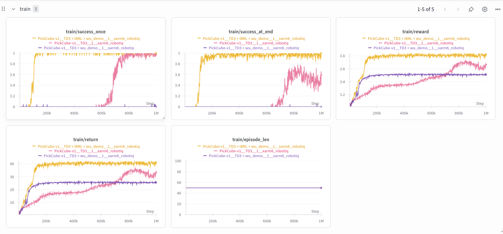
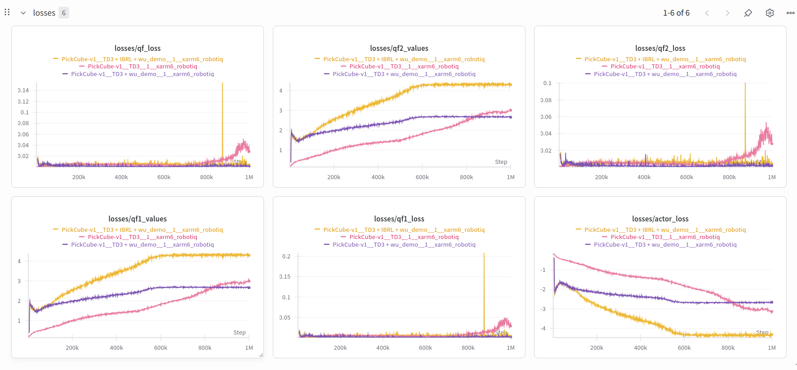
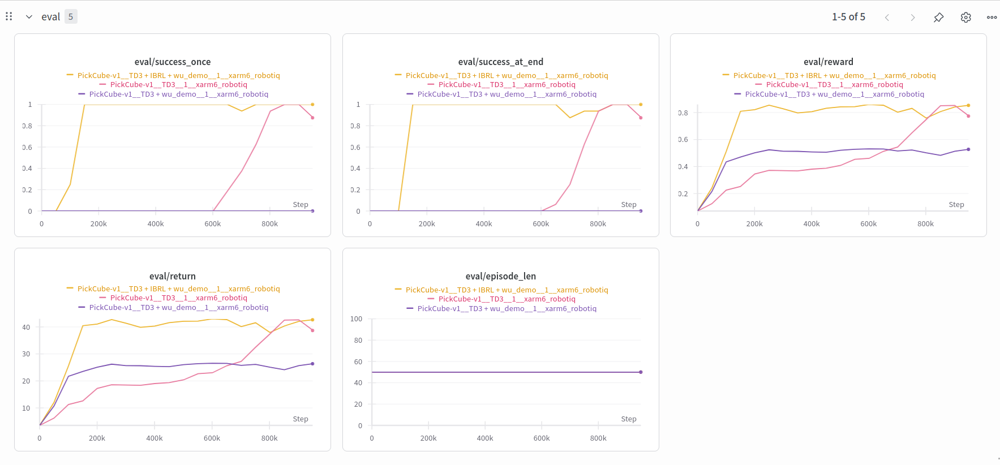
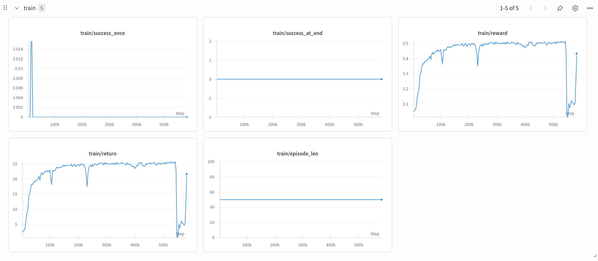
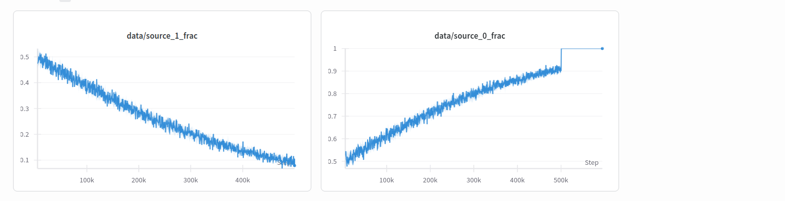

## **Daily log for ISRP**

### 2025/07/23
-   finished the [ibrl.py](./examples/baselines/ibrl/ibrl.py), which can run five different algos include:
    1. TD3
    2. TD3 + wu_demo
    3. TD3 + WSRL
    4. TD3 + wu_demo + IBRL
    5. TD3 + WSRL + IBRL
-   add the NameBuilder function inside the [ibrl.py](./examples/baselines/ibrl/ibrl.py), which let user define the folder and wandb name more easily 
-   compare three algos in PickCube-v1: TD3 vs TD3 + wu_demo vs TD3 + wu_demo + IBRL, the result show in the wandb test group, here are some result image:

little summary for each algos:
    1. for TD3, it perfom like TD3, although it return and reward go up very late, but it still success at the end.
    2. for TD3 + wu_demo, before 200k steps it reward and return go higher than the TD3, this is mainly cause by the wu_demo work, but after the 200k it stay stationary untill the run stop. my idea is that since i don't apply the trajectory selection during training part, so the wu_demo data will take over.
    3. for TD3 + wu_demo + IBRL, the success on early stage is reasonable.

-   tomorrow's tasks:
    1. modify the wu_demo part, let the policy sample the training data from 50 demo / 50 online(there should have a tag to divided the demo and online trajectory)
    2. complete the kubectl get pods for Nautilus
    3. read the "how to use Nautilus" slides
---
### 2025/07/24
-   finished the wu_demo part, using the sigmoid function, start at the 50 vs 50 : demo/policy vs env generate to 10 vs 90 at the end. also add the source tag in replay buffer, the tag appendix right now is 0 from env, 1 from wu_demo, 2 from wsrl. but still have a weird part that when global_steps hit the buffer_size, the demo/policy's trajectory will disappear.
-   keep test the TD3 + wu_demo algo, although apply the new time_increase_sample function, but the result still suck, have no idea what happend yet.
-   test the TD3 + WSRL +IBRL today, doing good but TD3 + IBRL + wu_demo still the fastest
-   did't see Dwait today, so tomorrow still have to do the nautilus things
-   ok new bug [link](https://wandb.ai/jaychou0819-uc-san-diego/ManiSkill-Rainbow/runs/rmnwl232?nw=nwuserjaychou0819):

can run other algo to check whether the bug exist.

-   tomorrow's tasks:
    1. fix the but found at the end of yesterday.
    2. do JSRL?
    3. do the Nautilus, ps: use cd ~/.kube and nano config to modify the config file
---
